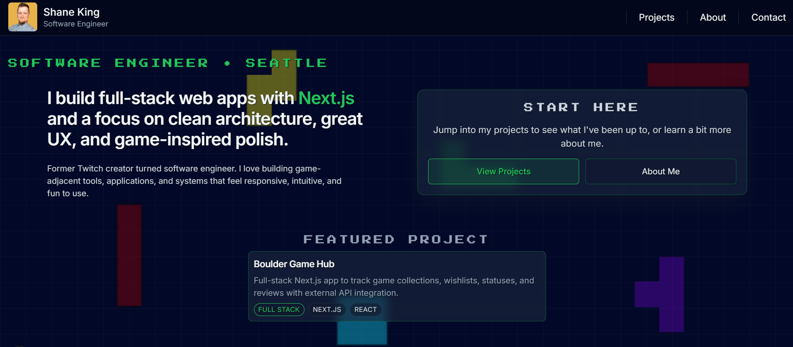

# Shane King — Developer Portfolio

Welcome to the source code for my personal portfolio website: **https://shaneking.pro**

This site showcases my projects, background, and contact information in a clean, responsive, and modern UI built with **Next.js**, **TypeScript**, and **Tailwind CSS**. It also includes interactive components such as a project image carousel with modal zooming, mobile-friendly navigation, and dynamically routed project pages.

---

## Tech Stack

- **Framework:** Next.js (App Router)
- **Language:** TypeScript
- **Styling:** Tailwind CSS
- **Deployment:** Vercel
- **Other Features:**
  - Custom project image carousel (with modal zoom)
  - Responsive navigation
  - Mobile swipe gestures
  - Clean, accessible UI

---

## Portfolio Preview

---

## Contact

If you'd like to connect:

- **Email:** [shane.m.king94@gmail.com](mailto:shane.m.king94@gmail.com)
- **Portfolio:** [https://shaneking.pro](https://shaneking.pro)
- **GitHub:** [https://github.com/shane-m-king](https://github.com/shane-m-king)
- **LinkedIn:** [https://linkedin.com/in/shane-m-king](https://linkedin.com/in/shane-m-king)

---

## License

MIT License — feel free to use this as inspiration but please do not copy without credit.
